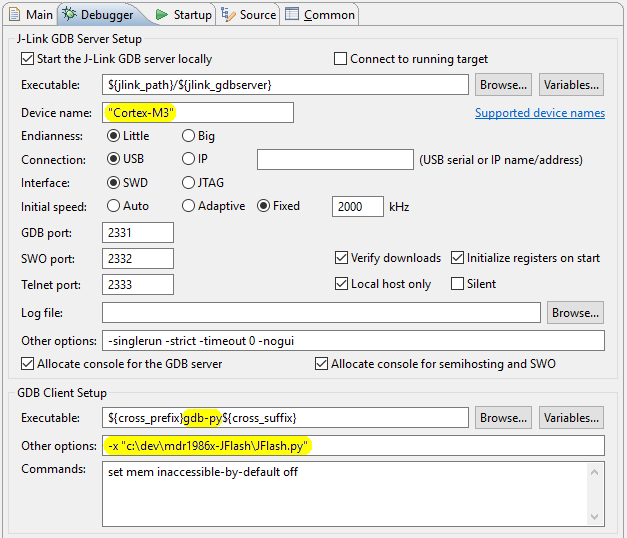
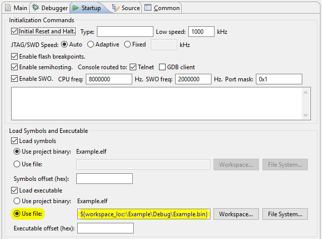

# Milandr MCU 1986x flashing with J-Link

### What's this project for?

- Debugging on [Milandr 32-bit Cortex-М MCU][milandr-mdr1986x] using [GNU MCU Eclipse][gnu-mcu-eclipse]
with the native [SEGGER J-Link drivers][segger-jlink].
- Internal EEPROM programming using [GNU toolchain][arm-gnu-toolchain].

Supported microcontrollers: __1986BE9x__ (MDR32F9Qx), __1986BE1__ (MDR32F1), __1986BE3__.

### What's the problem?

Unfortunately, SEGGER is not aware of Milandr MCU 1986x series existence, so the native drivers do not contain
the EEPROM programming algorithm for these microcontrollers. As a result, you are not able to use the native
J-Flash utilities.

Moreover, you have to use [OpenOCD][open-ocd] instead of the native drivers for debugging with GNU MCU Eclipse.
OpenOCD is quite good, but at present, it is slightly less functional, for example,
[OpenOCD debugging Eclipse plug-in][eclipse-openocd] does not support a capturing of Serial Wire Output (SWO).

The last problem is that you can use SEGGER [Real Time Transfer][segger-rtt] (RTT) only with the native drivers.

### How does it work?

- LOADER (RAMCode) implements the EEPROM programming algorithm.
- GDB script on [Python][gdb-python] – _"JFlash.py"_ redefines the GDB `load` command.

### Any limits?

__Windows__: Some GDB commands do not allow to quote filenames within `""`, so you can NOT use space characters
in J-Flash utilities installation path.

### How to...

---

<!-- MarkdownTOC autolink="true" bracket="round" depth=0 style="unordered" autoanchor="false" -->

- [How to program EEPROM using GNU toolchain](#how-to-program-eeprom-using-gnu-toolchain)
- [How to debug using GNU MCU Eclipse](#how-to-debug-using-gnu-mcu-eclipse)
- [How to check a program integrity in EEPROM at runtime](#how-to-check-a-program-integrity-in-eeprom-at-runtime)

<!-- /MarkdownTOC -->

---

#### How to program EEPROM using GNU toolchain

- Install [SEGGER J-Link Software][segger-jlink]. The script was tested with JLink `5.10`..`6.12`.
- Install [GNU toolchain][arm-gnu-toolchain]. The script was tested with GCC `4.9-2015-q3`.
- Install Python 2.7 ([32 bit][faq-python-32]) and set [PYTHONHOME][python-env] and [PYTHONPATH][python-env]
environment variables.
- You may need to add GNU toolchain path into PATH environment variable manually.

After that, you can run the following command to program EEPROM:
```
JFlash.bat <BIN_FILE>
```
First of all, this batch file starts the J-Link GDB server, and then the GDB client. The client executes
`program_from_shell` function from _"JFlash.py"_ script with the name of [the raw binary file][eclipse-extra]
as an argument, something like that:
```
start /B JLinkGDBServerCL -if swd -device "Cortex-M1" -endian little -speed 2000 -port 2331 -singlerun
arm-none-eabi-gdb-py --batch -x JFlash.py -ex "py program_from_shell('yourapp.bin')"
```

#### How to debug using GNU MCU Eclipse

- Install [GNU MCU Eclipse][eclipse-install].
- Configure [J-Link debugging Eclipse plug-in][eclipse-jlink].

- Into the debugger launch configuration `GDB SEGGER J-Link Debugging → Debugger`, you should:
1. Set `"Cortex-M1"` or `"Cortex-M3"` (depends on MCU) into `J-Link GDB Server Setup → Device name`.
2. Replace `gdb` with `gdb-py` in `GDB Client Setup → Executable`.
3. Add `-x JFlash.py` into `GDB Client Setup → Other options` (you have to use the full path to the script).



- Into `GDB SEGGER J-Link Debugging → Startup`, you should select
`Load Symbols and Executable → Load Executable → Use file`, and add the name of
[the raw binary file][eclipse-extra]. If you select an ELF file for loading, the script
will try to convert it into the raw binary using _"arm-none-eabi-objcopy"_ utility.



_"JFlash.py"_ script redefines GDB `load` command, so when Eclipse calls `load`, the script runs instead.

The script creates _"JFlash.log"_ in the folder of your current project, also LOADER prints a trace using RTT.
To launch RTT client (terminal) you should uncomment its call in _"JFlash.bat"_ file.

After programming, if the mapfile of our binary exists, _"JFlash.py"_ will set the address of RTT structure,
and you will be able to interact with the loaded binary using RTT client.
There is an example of RTT usage into [_"mdr1986x_RTT"_][mdr1986x_rtt] project.

#### How to check a program integrity in EEPROM at runtime

_"JFlash.py"_ script writes CRC-32 of the loaded binary file `aligned(4)` right after the image in EEPROM,
it could be compared with CRC-32 calculated by your program.

[milandr-mdr1986x]:  http://ic.milandr.ru/products/mikrokontrollery_i_protsessory/32_razryadnye_mikrokontrollery/
[open-ocd]:          http://openocd.org/
[segger-jlink]:      https://www.segger.com/jlink-software.html
[segger-rtt]:        https://www.segger.com/jlink-rtt.html
[arm-gnu-toolchain]: https://launchpad.net/gcc-arm-embedded/
[gnu-mcu-eclipse]:   https://gnu-mcu-eclipse.github.io/
[eclipse-install]:   https://gnu-mcu-eclipse.github.io/install/
[eclipse-jlink]:     https://gnu-mcu-eclipse.github.io/debug/jlink/
[eclipse-openocd]:   https://gnu-mcu-eclipse.github.io/debug/openocd/
[eclipse-extra]:     https://gnu-mcu-eclipse.github.io/plugins/features/#extra-build-steps
[gdb-python]:        https://sourceware.org/gdb/current/onlinedocs/gdb/Python.html
[faq-python-32]:     https://answers.launchpad.net/gcc-arm-embedded/+faq/2601
[python-env]:        https://docs.python.org/2/using/cmdline.html#environment-variables
[mdr1986x_rtt]:      https://github.com/in4lio/mdr1986x-pack-repo/tree/master/source/Example_Projects_Eclipse/mdr1986x_RTT
